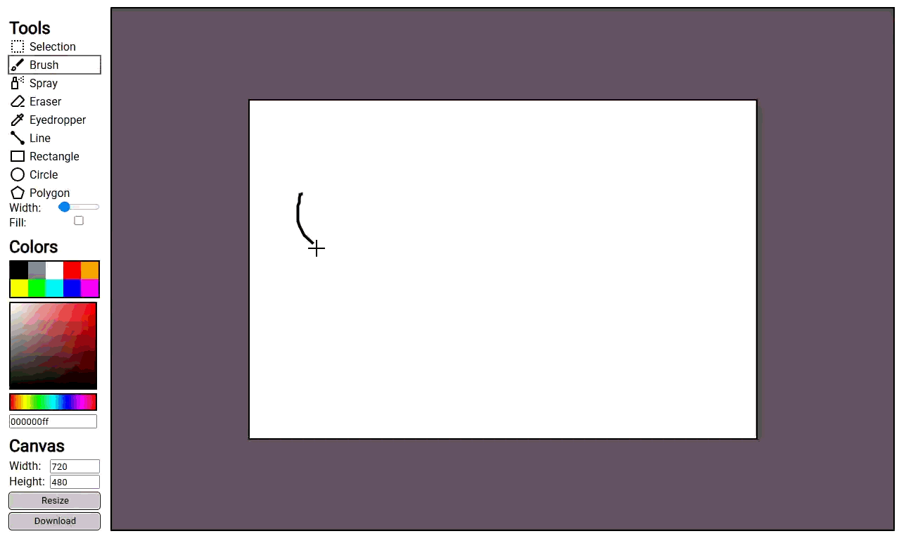

# Projeto: Remake de aplicação web simples



## Acesso

https://elc1090.github.io/project1-2026b-Alexandre-ChagasBrites/

## Desenvolvedor(a)

Alexandre Chagas Brites - Ciência da Computação

## App original

### Links

- Acesso: https://drawings-board.netlify.app/
- Repositório: https://github.com/jimmyurl/drawing-board

### Descrição

O drawing-board é um aplicativo web que permite criar imagens e desenhar nelas usando diversas ferramentas. Foi desenvolvido por [jimmyurl](https://github.com/jimmyurl),
utilizando apenas HTML, CSS e JavaScript. 
Substitua este texto por uma descrição do app original. Inclua observações sobre sua autoria, conteúdo, aparência e código.

## Demanda do(a) cliente

### Cliente

Victor Mateus Severo Ferreira

### Demanda

- Implementar a feature de desenho de polígonos
- Poder definir a resolução do quadro
- Ter um color picker que possibilita escolher qualquer cor em HSV
- Ferramenta de Spray
- Ferramenta de seleção que possibilita mover, rotacionar, escalar partes da imagem

## Desenvolvimento

### Processo

Eu comecei analisando o arquivo index.html enquanto o inspecionava com as developer tools do browser. Depois analisei como o javascript fazia o desenho no canvas.
Para o desenvolvimento eu fui copiando e modificando aos poucos as funcionalidades do projeto original. Após ter uma base que permitia desenhar, implementei as ferramentas
que não funcionavam no projeto original. As demandas foram implementadas junto de um melhor feedback sobre a ferramenta selecionada.

- [ ] Implementar a feature de desenho de polígonos
  - Suporta apenas pentágonos regulares 
- [x] Poder definir a resolução do quadro
- [x] Ter um color picker que possibilita escolher qualquer cor em HSV
- [x] Ferramenta de Spray
- [ ] Ferramenta de seleção que possibilita mover, rotacionar, escalar partes da imagem
  - Rotacionar e escalar partes da imagem não foi implementado

### Trechos de código

Coordenada do Cursor:
```
// Versão original
canvas.addEventListener("mousemove", drawing);
e.offsetX;
e.offsetY;

// Minha versão
viewport.addEventListener("mousemove", drawing);
let cursorX = e.clientX - canvas.getBoundingClientRect().x;
let cursorY = e.clientY - canvas.getBoundingClientRect().y;
```

Configuração da Ferramenta:
```
ctx.lineWidth = lineWidth;
ctx.strokeStyle = selectedTool === "eraser" ? "white" : selectedColor;
ctx.fillStyle = selectedColor;
ctx.globalCompositeOperation = selectedTool === "eraser" ? "destination-out" : "source-over";
```

Color Picker:
```
saturationValuePicker.style.backgroundBlendMode = 'multiply';
saturationValuePicker.style.backgroundImage = `linear-gradient(white, black),linear-gradient(to right, white, ${rgbToString(rgb)})`;
huePicker.style.backgroundImage = 'linear-gradient(to right, red, yellow, #00ff00, cyan, blue, magenta, red)';
```

## Tecnologias

### Linguagens e afins

- HTML
- CSS
- JavaScript

### Ambiente de desenvolvimento

- VS Code

## Referências e créditos

- https://developer.mozilla.org/pt-BR/
- https://github.com/aseprite/aseprite
- https://en.wikipedia.org/wiki/HSL_and_HSV
- https://stackoverflow.com/questions/23090019/fastest-formula-to-get-hue-from-rgb

---
Projeto entregue para a disciplina de [Desenvolvimento de Software para a Web](http://github.com/andreainfufsm/elc1090-2026b) em 2026b
